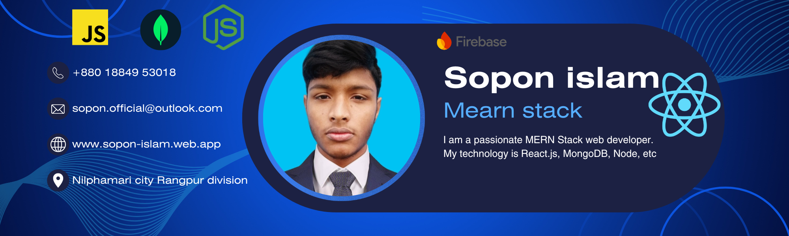

<h1 align="center">👋 Hi, I'm Sopon Islam | MERN Stack Developer</h1>

<h2 align="left">
  About Me 
  
  
</h2>

I'm a passionate <b>Full Stack Web Developer</b> specializing in the <b>MERN stack</b> with a strong focus on building real-world, scalable applications.  
I work extensively with tools and technologies such as <b>React</b>, <b>MongoDB</b>, <b>Firebase Authentication</b>, <b>Next.js</b>, <b>TailwindCSS</b>, and <b>JavaScript</b>.  

Currently, I’m diving deeper into:
<ul>
  <li>Next.js & NextAuth</li>
  <li>Mongoose & MongoDB optimization</li>
  <li>shadcn/ui & Mamba UI</li>
  <li>React Hook Form & Material UI</li>
</ul>

I also create developer-friendly platforms and share my knowledge through my YouTube channel <a href="https://www.youtube.com/channel/UCcALfXzRN45YsZXi-Pk9F1g" target="_blank"><b>Base Coder</b></a>.  
I love solving problems, writing clean, maintainable code, and contributing to the developer community.

---

## 📈 Current Activities
- 🌱 Learning **Next.js** for advanced full-stack development  
- 💻 Developing a **E-commerce Website** using the MERN stack  
- 🚀 Building **ForumHive** and **Career Code** web platforms  
- 📹 Producing JavaScript tutorials for **Base Coder** on YouTube  
- 🔍 Exploring backend architecture with **Firebase Auth** integration  

---

## 🛠️ Tech Stack

  
  
  
  
  
  
  
  
  

  

---

## 🎯 Categorized Skills

### 💻 Languages & Frameworks

### 🗄️ Databases

### 🎨 UI Libraries & Tools

### ⚙️ Tools & Platforms

---

## 🌐 Social Links

  
  
  

---

## 📊 GitHub Stats

  
  
  

